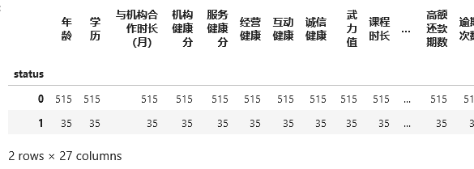
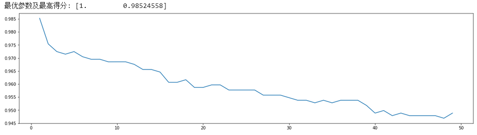
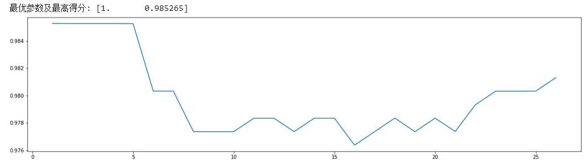

# 基于随机森林的培训机构学员分期付款行为预测

​		本文利用由青岛诚学信付科技有限公司提供的真实数据，结合该公司的诚学信付项目，根据用户行为：是否中途退学，是否发生过逾期，是否还清账款将用户分为优质量用户，良质量用户和差质量用户。将用户数据划分为不同群体进行分析，采用随机森林，结合十折交叉检验法对用户进行分类。

​		通过数据库取样观察发现，项目的退学人数与逾期人数相当，而逾期又分为曾经逾期但已还清（良好用户），超过还款期限仍未还清（差质量用户），所以我们将用户分为高质量用户（还清账款且从未逾期），良好用户（还清账款但曾经逾期），差质量用户（未还清账款），退学用户。


​		诚学信付项目简介：让教育消费者可以凭个人信用就能购买教育产品及服务，不需要一次性预交学费，也不需要办理贷款，而是凭个人的诚信在享受学习服务过程中或之后再分期向教育机构缴纳学费。


## 一  数据准备

###  1.1 数据的来源   

​		本文的数据由青岛诚学信付科技有限公司提供的真实数据。首先确定了逾期还款的可能影响因素，分为个人特征维度，贷款特征维度，机构特征维度。本文选取了以下15个影响因素：

​		个人特征维度：用户类型，性别，年龄，城市，学历，入学时间，历史逾期次数

​		贷款特征维度：课程时长，课程金额，分期金额，分期期数，分期服务费，首期还款天数，低额还款天数，低额还款比率，高额还款期数

​		机构特征维度：平台与机构合作时间，机构健康总分，机构服务健康分，机构经营健康分，机构互动健康分，机构诚信健康分，武力值

**注：数据集虽包括工作职业，工作状态，收入，是否拥有驾照等重要信息，但数据内容为空，为无用数据。**

### 1.2 变量描述

| 变量名           | 类型   | 注释                                                         |
| ---------------- | ------ | ------------------------------------------------------------ |
| 用户类型         | int    | 0「未指定」；<br/>1「正常分期用户」；<br/>2「政府扶持」；<br/>2「个人用户」； |
| 性别             | int    | 0「男」；<br/>1「女」                                        |
| 学历             | int    | 0学历：「初中及以下」；<br/>1学历：「高中/中专」；<br/>2学历：「大专」；<br/>3学历：「本科」；<br/>4学历：「硕士研究生」；<br/>5学历：「博士研究生以上」 |
| 年龄             | int    |                                                              |
| 省份             | string |                                                              |
| 学习是否结束     | string | 学习已结束<br />学习未结束                                   |
| 机构健康分       | int    |                                                              |
| 服务健康分       | int    |                                                              |
| 经营健康分       | int    |                                                              |
| 互动健康分       | int    |                                                              |
| 诚信健康分       | int    |                                                              |
| 武力值           | int    |                                                              |
| 课程时长         | int    |                                                              |
| 课程金额         | float  |                                                              |
| 分期金额         | float  |                                                              |
| 分期期数         | int    |                                                              |
| 分期服务费       | float  |                                                              |
| 首期还款天数     | int    |                                                              |
| 低额还款天数     | int    |                                                              |
| 低额还款比率     | float  |                                                              |
| 高额还款期数     | int    |                                                              |
| 首次还款是否逾期 | int    |                                                              |
| 历史逾期次数     | int    |                                                              |

### 1.3 数据处理

###### 处理缺失值

数据从数据库取出来时，部分字段值完全缺失，因此将删去那些空缺字段，对于性别缺失值，利用身份证号对缺失值进行补填。

###### 去除唯一属性

唯一属性通常是一些id属性，这些属性并不能刻画样本自身的分布规律，这里的身份证即是唯一属性。在处理完其他数据将删除此属性。

###### 特征编码

在数据整理过程中，我发现退学人数与逾期人数相当，因此将退学情况纳入考虑。 针对不同分类将建立不同的模型，关于用户的分类编码我将在后文给出。对于分类变量（如用户类型，性别等），采用  One-hot Encoding 进行编码。

###### 特征选择

在取出的数据中，我们发现有些属性不适合做为指标，例如描述性数据，公司名称，工作职业。

## 二 建立模型

### 2.1 预测用户是否退学模型

#### 2.1.1 数据选取

​		预测用户是否退学，本文选取的是已经结束服务的用户，共计1856条数据。

主要选取以下信息：

| 变量名                 | 类型   | 注释                                                         |
| ---------------------- | ------ | ------------------------------------------------------------ |
| usertype(用户类型)     | string | 未指定；<br/>正常分期用户；<br/>政府扶持；<br/>个人用户；    |
| sex(性别)              | string | 男；<br/>女                                                  |
| 学历                   | int    | 0：初中及以下；<br/>1：高中/中专；<br/>2：大专；<br/>3：本科；<br/>4：硕士研究生；<br/>5：博士研究生以上 |
| 年龄                   | int    |                                                              |
| province（省份）       | string |                                                              |
| studyEnd(学习是否结束) | string | 学习已结束<br />学习未结束                                   |
| 机构健康总分           | int    |                                                              |
| 合作时长（月）         | int    |                                                              |
| 服务健康分             | int    |                                                              |
| 经营健康分             | int    |                                                              |
| 互动健康分             | int    |                                                              |
| 诚信健康分             | int    |                                                              |
| 武力值                 | int    |                                                              |
| 课程时长               | int    |                                                              |
| 课程金额               | float  |                                                              |
| 分期金额               | float  |                                                              |
| 分期期数               | int    |                                                              |
| 分期服务费             | float  |                                                              |
| 首期还款天数           | int    |                                                              |
| 低额还款天数           | int    |                                                              |
| 低额还款比率           | float  |                                                              |
| 高额还款期数           | int    |                                                              |
| 是否曾经逾期           | string | 曾经逾期<br />从未逾期                                       |
| 逾期还款次数           | int    |                                                              |
| status                 | int    | 0：未退学<br />1：已退学                                     |

#### 2.1.2 模型训练

```python
#导入需要的包
import pandas as pd
import numpy as np
from imblearn.over_sampling import SMOTE
from sklearn import tree,metrics
from sklearn.model_selection import StratifiedShuffleSplit, RandomizedSearchCV, cross_val_score,train_test_split ,GridSearchCV
import matplotlib.pyplot as plt
from sklearn.metrics import f1_score
from sklearn.ensemble import RandomForestClassifier 
```

```python
#读取数据
data = pd.read_csv("C:/Users/HG/Documents/分析项目/终极1稿/模型一（是否会退学2）.csv",encoding="gbk")
print('训练集中各类别数据的个数：', data.groupby('status').size())
```

```
训练集中各类别数据的个数： status
0     788
1    1068
dtype: int64
```

```python
#对分类变量进行编码
usertype= pd.get_dummies(data.userType)
data=data.join(usertype)

sex= pd.get_dummies(data.sex)
data=data.join(sex)

studyEnd=pd.get_dummies(data.studyEnd)
data=data.join(studyEnd)

ifLate= pd.get_dummies(data.islate)
data=data.join(isLate)

data=data.drop(["userType",'sex',"studyEnd","islate"], axis=1)
data.columns
```

```txt
Index(['年龄', '学历', '合作时长（月）', '机构健康分', '服务健康分', '经营健康', '互动健康', '诚信健康', '武力值',
       '课程时长', '课程金额', '分期金额', '分期期数', 'status', '分期服务费', '首期还款天数', '低额还款天数',
       '低额还款比率', '高额还款期数', '逾期次数', '个人用户', '政府扶持', '正常分期用户', '诚学长青用户', '女',
       '男', '从未逾期', '曾经逾期', '学习已结束', '学习未结束'],
      dtype='object')
```

```python
#划分训练集和测试集
Datatrain,Datatest = train_test_split(data,test_size=0.3,random_state=42)
Ytrain = Datatrain["status"].values
Xtrain = Datatrain.drop("status", axis=1).values
Ytest = Datatest["status"].values
Xtest = Datatest.drop("status", axis=1).values
```

```python
#查看训练集
Datatrain.groupby('status').size()
```

```
status
0    549
1    750
dtype: int64
```

```python
#查看测试集
Datatest.groupby('status').size()
```

```
status
0    239
1    318
dtype: int64
```

```python
#绘制ROC曲线
def plot_roc(labels, predict_prob):
    false_positive_rate, true_positive_rate, thresholds = metrics.roc_curve(labels, predict_prob)
    roc_auc = metrics.auc(false_positive_rate, true_positive_rate)  #计算AUC值
    print('AUC=' + str(roc_auc))
    plt.title('PC5-ROC')
    plt.plot(false_positive_rate, true_positive_rate, 'b', label='AUC = %0.4f' % roc_auc)
    plt.legend(loc='lower right')
    plt.plot([0, 1], [0, 1], 'r--')
    plt.ylabel('TPR')
    plt.xlabel('FPR')
    plt.show()
```

```python
#未调参前
rfc = RandomForestClassifier(n_estimators=100,n_jobs=-1,random_state=42) 
score_pre = cross_val_score(rfc,Xtrain, Ytrain,cv=10).mean()
rfc.fit(Xtrain,Ytrain)
y_predict = rfc.predict(Xtest)
score_pre
```

```txt
0.944561717352415
```

```python
#混淆矩阵输出，正确的是0：238；1:318
print('混淆矩阵输出:',metrics.confusion_matrix(Ytest,y_predict))
```

```txt
混淆矩阵输出：[ [226  13]
			 [9   309] ]
```

未调参的模型将测试集318个正例中309个正确分类

```python
#预测准确率输出
print('查准率:', metrics.accuracy_score(Ytest, y_predict))
```

```txt
查准率: 0.9605026929982047
```

```python
#查全率
print('查全率:',metrics.recall_score(Ytest,y_predict))
```

```txt
查全率: 0.9716981132075472
```

```python
#预测平均f1-score输出   
print('平均F1-score:',metrics.f1_score(Ytest,y_predict,average='weighted'))
```

```txt
平均F1-score: 0.9604594667787802
```

```python
#绘制ROC曲线并求出AUC值
plot_roc(Ytest, y_predict)  
```


```python
#未调参的模型准确率已经较好了，接下来进行调参
#调整决策树数目
ScoreAll_1 = []
for i in range(100,300,5):
    rfc = RandomForestClassifier(n_estimators=i
                                 ,n_jobs=-1
                                 ,random_state=42
                                )
    score = cross_val_score(rfc, Xtrain, Ytrain, cv=10).mean()
    ScoreAll_1.append([i, score])
ScoreAll_1 = np.array(ScoreAll_1)
max_score = np.where(ScoreAll_1 == np.max(ScoreAll_1[:, 1]))[0][0]  # 找出最高得分对应的索引
print("最优参数及最高得分:",ScoreAll_1[max_score]) 
plt.figure(figsize=[20, 5])
plt.plot(ScoreAll_1[:, 0], ScoreAll_1[:, 1])
plt.show()
```


对比未调参前的 score_pre=0.944561717352415 <  0.9491771 ，说明调整决策树数目有助于提高模型准确性，下面将在 n_estimators=145 附近继续调整

```python
#在145左右进行具体分析
ScoreAll_2 = []
cv = StratifiedShuffleSplit(n_splits=10, test_size=0.1, random_state=42)
for i in range(120,160,1):
    rfc = RandomForestClassifier(n_estimators=i
                                 ,n_jobs=-1
                                 ,random_state=42
                                )
    score = cross_val_score(rfc, Xtrain, Ytrain, cv=10).mean()
    ScoreAll_2.append([i, score])
ScoreAll_2 = np.array(ScoreAll_2)
max_score = np.where(ScoreAll_2 == np.max(ScoreAll_2[:, 1]))[0][0]  # 找出最高得分对应的索引
print("最优参数及最高得分:",ScoreAll_2[max_score]) 
plt.figure(figsize=[20, 5])
plt.plot(ScoreAll_2[:, 0], ScoreAll_2[:, 1])
plt.show()
```


确定决策树数目为 123棵（或145棵），接下来对 max_depth 进行调整

```python
#调整max_depth
ScoreAll_3 = []
cv = StratifiedShuffleSplit(n_splits=10, test_size=0.1, random_state=42)
for i in range(1,50):
    rfc = RandomForestClassifier(n_estimators=123
                                 ,n_jobs=-1
                                 ,max_depth=i
                                 ,random_state=42
                                )
    score = cross_val_score(rfc, Xtrain, Ytrain, cv=10).mean()
    ScoreAll_3.append([i, score])
ScoreAll_3 = np.array(ScoreAll_3)
max_score = np.where(ScoreAll_3 == np.max(ScoreAll_3[:, 1]))[0][0]  # 找出最高得分对应的索引
print("最优参数及最高得分:",ScoreAll_3[max_score]) 
plt.figure(figsize=[20, 5])
plt.plot(ScoreAll_3[:, 0], ScoreAll_3[:, 1])
plt.show()
```


准确率继续上升，说明调整 max_depth 有效，接下来调整 min_samples_split

```python
#调整min_samples_split
ScoreAll_4 = []
cv = StratifiedShuffleSplit(n_splits=10, test_size=0.1, random_state=42)
for i in range(2,50):
    rfc = RandomForestClassifier(n_estimators=123
                                 ,n_jobs=-1
                                 ,max_depth=9
                                 ,min_samples_split=i
                                 ,random_state=42
                                )
    score = cross_val_score(rfc, Xtrain, Ytrain, cv=10).mean()
    ScoreAll_4.append([i, score])
ScoreAll_4 = np.array(ScoreAll_4)
max_score = np.where(ScoreAll_4 == np.max(ScoreAll_4[:, 1]))[0][0]  # 找出最高得分对应的索引
print("最优参数及最高得分:",ScoreAll_4[max_score]) 
plt.figure(figsize=[20, 5])
plt.plot(ScoreAll_4[:, 0], ScoreAll_4[:, 1])
plt.show()
```


准确率没有继续上升，接下来调整 min_samples_leaf

```python
#调整min_samples_leaf
ScoreAll_5 = []
cv = StratifiedShuffleSplit(n_splits=10, test_size=0.1, random_state=42)
for i in range(1,50):
    rfc = RandomForestClassifier(n_estimators=123
                                 ,n_jobs=-1
                                 ,max_depth=9
                                 ,min_samples_leaf=i
                                 ,random_state=42
                                )
    score = cross_val_score(rfc, Xtrain, Ytrain, cv=10).mean()
    ScoreAll_5.append([i, score])
ScoreAll_5 = np.array(ScoreAll_5)
max_score = np.where(ScoreAll_5 == np.max(ScoreAll_5[:, 1]))[0][0]  # 找出最高得分对应的索引
print("最优参数及最高得分:",ScoreAll_5[max_score]) 
plt.figure(figsize=[20, 5])
plt.plot(ScoreAll_5[:, 0], ScoreAll_5[:, 1])
plt.show()
```


模型准确率没有变化，接下来调整max_features

```python
#调整max_features
ScoreAll_6 = []
cv = StratifiedShuffleSplit(n_splits=10, test_size=0.1, random_state=42)
for i in range(1,29):
    rfc = RandomForestClassifier(n_estimators=123
                                 ,n_jobs=-1
                                 ,max_depth=9
                                 ,max_features=i
                                 ,random_state=42
                                )
    score = cross_val_score(rfc, Xtrain, Ytrain, cv=10).mean()
    ScoreAll_6.append([i, score])
ScoreAll_6 = np.array(ScoreAll_6)
max_score = np.where(ScoreAll_6 == np.max(ScoreAll_6[:, 1]))[0][0]  # 找出最高得分对应的索引
print("最优参数及最高得分:",ScoreAll_6[max_score]) 
plt.figure(figsize=[20, 5])
plt.plot(ScoreAll_6[:, 0], ScoreAll_6[:, 1])
plt.show()
```


调整 max_features = 26，准确率上升至 0.95610018 ，最后来调整Criterion

```python
#调整Criterion
param_grid = {'criterion':['gini', 'entropy']}
rfc = RandomForestClassifier(n_estimators=123
                                 ,n_jobs=-1
                                 ,max_depth=9
                                 ,max_features=7
                                 ,random_state=42
                            ) 
GS4 = GridSearchCV(rfc,param_grid,cv=10) 
GS4.fit(Xtrain, Ytrain)
print ("最优参数及最高得分:",GS4.best_params_,GS4.best_score_)
```

```
最优参数及最高得分: {'criterion': 'gini'} 0.9561001788908765
```

最终模型为

```python
#调参后
model = RandomForestClassifier(n_estimators=123
                               ,n_jobs=-1
                               ,max_depth=9
                               ,max_features=7
                               ,random_state=42) 
score = cross_val_score(model,Xtrain, Ytrain,cv=10).mean()
model.fit(Xtrain, Ytrain)
y_NewPredict = model.predict(Xtest)
score
```

```txt
0.9561001788908765
```

score = 0.9561001788908765 >  score_pre=0.944561717352415 ，可见调参后模型准确率上升，接下来对模型进行评估

```python
#预测准确率输出
print('查准率:', metrics.accuracy_score(Ytest, y_predict))
```

```
查准率: 0.9694793536804309
```

```python
#混淆矩阵输出，正确的是0：238；1:318
print('混淆矩阵输出:',metrics.confusion_matrix(Ytest,y_NewPredict))
```

```txt
混淆矩阵输出: [ [233  6]
 			  [11   307]]
```

在 318个用户中成功预测出307个退学用户

```python
#查全率
print('查全率:',metrics.recall_score(Ytest,y_predict))
```

```txt
查全率: 0.9716981132075472
```

```python
#预测平均f1-score输出   
print('平均F1-score:',metrics.f1_score(Ytest,y_predict,average='weighted'))
```

```txt
平均F1-score: 0.9716981132075472
```

```python
#绘制ROC曲线并求出AUC值
plot_roc(Ytest, y_NewPredict)
```


#### 2.1.3 模型评估

​		最终的模型共有123棵树，最大深度为9，选取的特征子集中特征的个数为7个，模型预测准确率为0.9561001788908765，查全率为0.9716981132075472，平均 f1-score 值为0.9716981132075472，AUC值为0.9701521012604932 ，模型的表现良好。     

### 2.2 预测用户是否会逾期模型

#### 2.2.1 数据选取

​		预测用户是否逾期，选取已经开始还款的所有用户，共计9468条数据。

主要选取以下信息：

| 变量名               | 类型   | 注释                                                         |
| -------------------- | ------ | ------------------------------------------------------------ |
| userType(用户类型)   | string | 未指定；<br/>正常分期用户；<br/>政府扶持；<br/>个人用户；    |
| sex(性别)            | string | 男；<br/>女                                                  |
| 学历                 | int    | 0：初中及以下；<br/>1：高中/中专；<br/>2：大专；<br/>3：本科；<br/>4：硕士研究生；<br/>5：博士研究生以上 |
| 年龄                 | int    |                                                              |
| province（省份）     | string |                                                              |
| sdyEnd(学习是否结束) | string | 学习已结束<br />学习未结束                                   |
| 机构健康总分         | int    |                                                              |
| 合作时长（月）       | int    |                                                              |
| 服务健康分           | int    |                                                              |
| 经营健康分           | int    |                                                              |
| 互动健康分           | int    |                                                              |
| 诚信健康分           | int    |                                                              |
| 武力值               | int    |                                                              |
| 课程时长             | int    |                                                              |
| 课程金额             | float  |                                                              |
| 分期金额             | float  |                                                              |
| 分期期数             | int    |                                                              |
| 分期服务费           | float  |                                                              |
| 首期还款天数         | int    |                                                              |
| 低额还款天数         | int    |                                                              |
| 低额还款比率         | float  |                                                              |
| 高额还款期数         | int    |                                                              |
| status               | int    | 0：不会逾期<br />1：会逾期                                   |

#### 2.2.2 模型训练

```python
#导入需要的包
import pandas as pd
import numpy as np
from imblearn.over_sampling import SMOTE
from sklearn import tree,metrics
from sklearn.model_selection import StratifiedShuffleSplit, RandomizedSearchCV, cross_val_score,train_test_split ,GridSearchCV
import matplotlib.pyplot as plt
from sklearn.metrics import f1_score
from sklearn.ensemble import RandomForestClassifier 
```

```python
#读取数据
data = pd.read_csv("C:/Users/HG/Documents/分析项目/终极1稿/会不会逾期.csv",encoding="gbk")
print('训练集中各类别数据的个数：', data.groupby('status').size())
data.columns
```

```
训练集中各类别数据的个数： status
0    7896
1    1572
```

```python
#对分类变量进行编码
usertype= pd.get_dummies(data.userType)
data=data.join(usertype)

sex= pd.get_dummies(data.sex)
data=data.join(sex)

sdyEnd= pd.get_dummies(data.sdyEnd)
data=data.join(sdyEnd)

data=data.drop(["userType",'sex',"province",'sdyEnd'], axis=1)
data.columns
```

```
Index(['年龄', '学历', '与机构合作时长（月）', '机构健康分', '服务健康分', '经营健康', '互动健康', '诚信健康',
       '武力值', '课程时长', '课程金额', '分期金额', '分期期数', '分期服务费', '首期还款天数', '低额还款天数',
       '低额还款比率', '高额还款期数', 'status', '个人用户', '政府扶持', '正常分期用户', '诚学长青用户', '女',
       '男', '学习已结束', '学习未结束'],
      dtype='object')
```

```python
#划分训练集和测试集
Datatrain,Datatest = train_test_split(data,test_size=0.3,random_state=42)
```

```python
#原始训练集
Datatrain.groupby('status').size()
```

```
status
0    5552
1    1075
dtype: int64
```

```python
#原始测试集
Datatest.groupby('status').size()
```

```
status
0    2344
1     497
dtype: int64
```

```python
Ytrain = Datatrain["status"].values
Xtrain = Datatrain.drop("status", axis=1).values
Ytest = Datatest["status"].values
Xtest = Datatest.drop("status", axis=1).values
```

```python
#未调参前
rfc = RandomForestClassifier(n_estimators=100,n_jobs=-1,random_state=42) 
score_pre = cross_val_score(rfc,Xtrain, Ytrain,cv=10).mean()
rfc.fit(Xtrain,Ytrain)
#score_pre= rfc.score(Xtest,Ytest)
y_predict = rfc.predict(Xtest)
score_pre
```

```
0.8204305705549707
```

```python
#混淆矩阵输出，正确的是0：2344；1:497
print('混淆矩阵输出:',metrics.confusion_matrix(Ytest,y_predict))
```

```python
混淆矩阵输出: [[2170  174]
            [ 366  131]]
```

```python
#预测准确率输出
print('查准率:', metrics.accuracy_score(Ytest, y_predict))
```

```python
查准率: 0.8099260823653643
```

```python
#查全率
print('查全率:',metrics.recall_score(Ytest,y_predict))
```

```
查全率: 0.2635814889336016
```

```python
#预测平均f1-score输出   
print('平均F1-score:',metrics.f1_score(Ytest,y_predict,average='weighted'))
```

```
平均F1-score: 0.7909132512599955
```

```python
#绘制ROC曲线并求出AUC值
plot_roc(Ytest, y_predict)  
```


```python
#调整决策树数目
ScoreAll_1 = []
for i in range(100,300,5):
    rfc = RandomForestClassifier(n_estimators=i
                                 ,n_jobs=-1
                                 ,random_state=42
                                )
    score = cross_val_score(rfc, Xtrain, Ytrain, cv=10).mean()
    ScoreAll_1.append([i, score])
ScoreAll_1 = np.array(ScoreAll_1)
max_score = np.where(ScoreAll_1 == np.max(ScoreAll_1[:, 1]))[0][0]  # 找出最高得分对应的索引
print("最优参数及最高得分:",ScoreAll_1[max_score]) 
plt.figure(figsize=[20, 5])
plt.plot(ScoreAll_1[:, 0], ScoreAll_1[:, 1])
plt.show()
```


对比未调参前的 score_pre=0.8204305705549707 <  0.82163698 ，说明调整决策树数目有助于提高模型准确性，下面将在 n_estimators=200 附近继续调整：

```sql
#在200左右进行具体分析
ScoreAll_2 = []
cv = StratifiedShuffleSplit(n_splits=10, test_size=0.1, random_state=42)
for i in range(150,250,1):
    rfc = RandomForestClassifier(n_estimators=i
                                 ,n_jobs=-1
                                 ,random_state=42
                                )
    score = cross_val_score(rfc, Xtrain, Ytrain, cv=10).mean()
    ScoreAll_2.append([i, score])
ScoreAll_2 = np.array(ScoreAll_2)
max_score = np.where(ScoreAll_2 == np.max(ScoreAll_2[:, 1]))[0][0]  # 找出最高得分对应的索引
print("最优参数及最高得分:",ScoreAll_2[max_score]) 
plt.figure(figsize=[20, 5])
plt.plot(ScoreAll_2[:, 0], ScoreAll_2[:, 1])
plt.show()
```


确定决策树数目为 196棵，此时score=0.82193864，对比n_estimators=200有所上升，接下来对 max_depth 进行调整：

```python
#调整max_depth
ScoreAll_3 = []
cv = StratifiedShuffleSplit(n_splits=10, test_size=0.1, random_state=42)
for i in range(1,50):
    rfc = RandomForestClassifier(n_estimators=196
                                 ,n_jobs=-1
                                 ,max_depth=i
                                 ,random_state=42
                                )
    score = cross_val_score(rfc, Xtrain, Ytrain, cv=10).mean()
    ScoreAll_3.append([i, score])
ScoreAll_3 = np.array(ScoreAll_3)
max_score = np.where(ScoreAll_3 == np.max(ScoreAll_3[:, 1]))[0][0]  # 找出最高得分对应的索引
print("最优参数及最高得分:",ScoreAll_3[max_score]) 
plt.figure(figsize=[20, 5])
plt.plot(ScoreAll_3[:, 0], ScoreAll_3[:, 1])
plt.show()
```


max_depth的调整对模型有较大的提高

```python
#调整min_samples_split
ScoreAll_4 = []
cv = StratifiedShuffleSplit(n_splits=10, test_size=0.1, random_state=42)
for i in range(2,50):
    rfc = RandomForestClassifier(n_estimators=169
                                 ,n_jobs=-1
                                 ,max_depth=9
                                 ,min_samples_split=i
                                 ,random_state=42
                                )
    score = cross_val_score(rfc, Xtrain, Ytrain, cv=10).mean()
    ScoreAll_4.append([i, score])
ScoreAll_4 = np.array(ScoreAll_4)
max_score = np.where(ScoreAll_4 == np.max(ScoreAll_4[:, 1]))[0][0]  # 找出最高得分对应的索引
print("最优参数及最高得分:",ScoreAll_4[max_score]) 
plt.figure(figsize=[20, 5])
plt.plot(ScoreAll_4[:, 0], ScoreAll_4[:, 1])
plt.show()
```


min_samples_split的调整对模型也有提高

```python
#调整min_samples_leaf
ScoreAll_5 = []
cv = StratifiedShuffleSplit(n_splits=10, test_size=0.1, random_state=42)
for i in range(1,50):
    rfc = RandomForestClassifier(n_estimators=169
                                 ,n_jobs=-1
                                 ,max_depth=9
                                 ,min_samples_leaf=i
                                 ,min_samples_split=6
                                 ,random_state=42
                                )
    score = cross_val_score(rfc, Xtrain, Ytrain, cv=10).mean()
    ScoreAll_5.append([i, score])
ScoreAll_5 = np.array(ScoreAll_5)
max_score = np.where(ScoreAll_5 == np.max(ScoreAll_5[:, 1]))[0][0]  # 找出最高得分对应的索引
print("最优参数及最高得分:",ScoreAll_5[max_score]) 
plt.figure(figsize=[20, 5])
plt.plot(ScoreAll_5[:, 0], ScoreAll_5[:, 1])
plt.show()
```


min_samples_leaf的调整对模型没有明显的改进，接下来调整max_features：

```python
#调整max_features
ScoreAll_6 = []
cv = StratifiedShuffleSplit(n_splits=10, test_size=0.1, random_state=42)
for i in range(1,26):
    rfc = RandomForestClassifier(n_estimators=169
                                 ,n_jobs=-1
                                 ,max_depth=9
                                 ,min_samples_split=6
                                 ,max_features=i
                                 ,random_state=42
                                )
    score = cross_val_score(rfc, Xtrain, Ytrain, cv=10).mean()
    ScoreAll_6.append([i, score])
ScoreAll_6 = np.array(ScoreAll_6)
max_score = np.where(ScoreAll_6 == np.max(ScoreAll_6[:, 1]))[0][0]  # 找出最高得分对应的索引
print("最优参数及最高得分:",ScoreAll_6[max_score]) 
plt.figure(figsize=[20, 5])
plt.plot(ScoreAll_6[:, 0], ScoreAll_6[:, 1])
plt.show()
```


```python
#调整Criterion
param_grid = {'criterion':['gini', 'entropy']}
rfc = RandomForestClassifier(n_estimators=169
                                 ,n_jobs=-1
                                 ,max_depth=9
                                 ,min_samples_split=6
                                 ,max_features=5
                                 ,random_state=42
                            ) 
GS4 = GridSearchCV(rfc,param_grid,cv=10) 
GS4.fit(Xtrain, Ytrain)
print ("最优参数及最高得分:",GS4.best_params_,GS4.best_score_)
```

```
最优参数及最高得分: {'criterion': 'gini'} 0.8445787936369064
```

```python
#调参后
model = RandomForestClassifier(n_estimators=169
                                 ,n_jobs=-1
                                 ,max_depth=9
                                 ,min_samples_split=6
                                 ,max_features=5
                                 ,random_state=42) 
score = cross_val_score(model,Xtrain, Ytrain,cv=10).mean()
model.fit(Xtrain, Ytrain)
y_NewPredict = model.predict(Xtest)
score
```

```
0.8445787936369064
```

```python
#预测准确率输出
print('准确率:', metrics.accuracy_score(Ytest, y_NewPredict))
```

```
准确率: 0.8345652939105949
```

```python
#混淆矩阵输出，正确的是0：2344；1:497
print('混淆矩阵输出:',metrics.confusion_matrix(Ytest,y_NewPredict))
```

```python
混淆矩阵输出: [[2293   51]
 			[ 419   78]]
```

```python
#查全率
print('查全率:',metrics.recall_score(Ytest,y_predict))
```

```
查全率: 0.2635814889336016
```

```python
#预测平均f1-score输出   
print('平均F1-score:',metrics.f1_score(Ytest,y_predict,average='weighted'))
```

```python
平均F1-score: 0.7909132512599955
```

```python
#绘制ROC曲线并求出AUC值
plot_roc(Ytest, y_NewPredict)
```


#### 2.2.3 模型评估

​		对比未调参前的 score_pre=0.8204305705549707 <  0.8445787936369064，说明调整参数提高模型准确性。最终模型共有169棵树，最大深度为9，内部节点再划分所需最小样本数为,6，最大特征数为5，模型预测准确率为0.8345652939105949，查全率为0.2635814889336016，平均 f1-score 值为0.7909132512599955，AUC值为0.5675919853592545。虽然模型的正确率达0.8457861136553158 ，但我们关注的是能否预测出逾期的用户，在497名逾期用户中仅仅预测出78名，效果是很不理想的。

### 2.3 预测用户是否会还清账款

#### 2.3.1 数据选取

​		预测用户是否逾期，选取已经结束服务的用户（不包含退学用户），共计787条数据。

主要选取以下特征：

| 变量名               | 类型   | 注释                                                         |
| -------------------- | ------ | ------------------------------------------------------------ |
| usertype(用户类型)   | string | 未指定；<br/>正常分期用户；<br/>政府扶持；<br/>个人用户；    |
| sex(性别)            | string | 男；<br/>女                                                  |
| 学历                 | int    | 0：初中及以下；<br/>1：高中/中专；<br/>2：大专；<br/>3：本科；<br/>4：硕士研究生；<br/>5：博士研究生以上 |
| 年龄                 | int    |                                                              |
| province（省份）     | string |                                                              |
| sdyEnd(学习是否结束) | string | 学习已结束<br />学习未结束                                   |
| 机构健康总分         | int    |                                                              |
| 合作时长（月）       | int    |                                                              |
| 服务健康分           | int    |                                                              |
| 经营健康分           | int    |                                                              |
| 互动健康分           | int    |                                                              |
| 诚信健康分           | int    |                                                              |
| 武力值               | int    |                                                              |
| 课程时长             | int    |                                                              |
| 课程金额             | float  |                                                              |
| 分期金额             | float  |                                                              |
| 分期期数             | int    |                                                              |
| 分期服务费           | float  |                                                              |
| 首期还款天数         | int    |                                                              |
| 低额还款天数         | int    |                                                              |
| 低额还款比率         | float  |                                                              |
| 高额还款期数         | int    |                                                              |
| status               | int    | 0：还清账款<br />1：未还清账款                               |

#### 2.3.2 模型训练

```python
#导入需要的包
import pandas as pd
import numpy as np
from imblearn.over_sampling import SMOTE
from sklearn import tree,metrics
from sklearn.model_selection import StratifiedShuffleSplit, RandomizedSearchCV, cross_val_score,train_test_split ,GridSearchCV
import matplotlib.pyplot as plt
from sklearn.metrics import f1_score
from sklearn.ensemble import RandomForestClassifier 
```

```python
#读取数据
data = pd.read_csv("C:/Users/HG/Documents/分析项目/终极1稿/模型三（会不会还清）.csv",encoding="gbk")
print('训练集中各类别数据的个数：', data.groupby('status').size())
```

```
训练集中各类别数据的个数： status
0    738
1     49
dtype: int64
```

```python
#对分类变量进行编码
usertype= pd.get_dummies(data.userType)
data=data.join(usertype)

studyEnd= pd.get_dummies(data.studyEnd)
data=data.join(studyEnd)

firstReturn= pd.get_dummies(data.firstReturn)
data=data.join(firstReturn)
data=data.drop(["userType",'sex',"province","studyEnd","firstReturn"], axis=1)
data.columns
```

```
Index(['年龄', '学历', '与机构合作时长（月）', '机构健康分', '服务健康分', '经营健康', '互动健康', '诚信健康',
       '武力值', '课程时长', '课程金额', '分期金额', '分期期数', '分期服务费', '首期还款天数', '低额还款天数',
       '低额还款比率', '高额还款期数', '逾期次数', 'status', '个人用户', '正常分期用户', '女', '男',
       '学习已结束', '学习未结束', '第一次还款未逾期', '第一次还款逾期'],
      dtype='object')
```

```python
#观察数据
#原始训练集
groupby_data_oranginal = Datatrain.groupby('status').count()
groupby_data_oranginal
```



数据存在不均衡情况，采用欠采样方法（尝试过过采样，欠采样方法，效果均不理想）

```python
from imblearn.combine import SMOTETomek
X_train = Datatrain
y = Datatrain['status']
kos = SMOTETomek(random_state=42)  # 综合采样
X_res, y_res = kos.fit_resample(X_train, y)
X_res.groupby(['status']).size()
```

```
status
0    508
1    508
dtype: int64
```

```python
Ytrain = y_res
Xtrain = X_res.drop("status", axis=1).values
Ytest = Datatest["status"].values
Xtest = Datatest.drop("status", axis=1).values
```

数据不均衡问题处理后，进行模型建立

```python
#未调参前
rfc = RandomForestClassifier(n_estimators=100,n_jobs=-1,random_state=42) 
score_pre = cross_val_score(rfc,Xtrain, Ytrain,cv=10).mean()
rfc.fit(Xtrain,Ytrain)
#score_pre= rfc.score(Xtest,Ytest)
y_predict = rfc.predict(Xtest)
score_pre
```

```
0.9832750922151039
```

```python
#混淆矩阵输出，正确的是0：203；1:18
print('混淆矩阵输出:',metrics.confusion_matrix(Ytest,y_predict))
```

```
混淆矩阵输出: [[217   6]
 			[  8   6]]
```

从混淆矩阵看出，14个未还清用户中预测出6个

```python
#预测准确率输出
print('查准率:', metrics.accuracy_score(Ytest, y_predict))
```

```
查准率:  0.9409282700421941
```

```python
#查全率
print('查全率:',metrics.recall_score(Ytest,y_predict))
```

```
查全率: 0.42857142857142855
```

```python
#预测平均f1-score输出   
print('平均F1-score:',metrics.f1_score(Ytest,y_predict,average='weighted'))
```

```
平均F1-score: 0.9387881369685166
```

```python
#绘制ROC曲线并求出AUC值
plot_roc(Ytest, y_predict)  
```


```python
#调整决策树数目
ScoreAll_1 = []
for i in range(100,300,5):
    rfc = RandomForestClassifier(n_estimators=i
                                 ,n_jobs=-1
                                 ,random_state=42
                                )
    score = cross_val_score(rfc, Xtrain, Ytrain, cv=10).mean()
    ScoreAll_1.append([i, score])
ScoreAll_1 = np.array(ScoreAll_1)
max_score = np.where(ScoreAll_1 == np.max(ScoreAll_1[:, 1]))[0][0]  # 找出最高得分对应的索引
print("最优参数及最高得分:",ScoreAll_1[max_score]) 
plt.figure(figsize=[20, 5])
plt.plot(ScoreAll_1[:, 0], ScoreAll_1[:, 1])
plt.show()
```


对比未调参前的 score_pre=0.9832750922151039 <  0.98524558 ，说明调整决策树数目有助于提高模型准确性，下面将在 n_estimators=200附近继续调整

```python
#在200左右进行具体分析
ScoreAll_2 = []
cv = StratifiedShuffleSplit(n_splits=10, test_size=0.1, random_state=42)
for i in range(180,220,1):
    rfc = RandomForestClassifier(n_estimators=i
                                 ,n_jobs=-1
                                 ,random_state=42
                                )
    score = cross_val_score(rfc, Xtrain, Ytrain, cv=10).mean()
    ScoreAll_2.append([i, score])
ScoreAll_2 = np.array(ScoreAll_2)
max_score = np.where(ScoreAll_2 == np.max(ScoreAll_2[:, 1]))[0][0]  # 找出最高得分对应的索引
print("最优参数及最高得分:",ScoreAll_2[max_score]) 
plt.figure(figsize=[20, 5])
plt.plot(ScoreAll_2[:, 0], ScoreAll_2[:, 1])
plt.show()
```


确定决策树数目为 200 棵，接下来对 max_depth 进行调整

```python
#调整max_depth
ScoreAll_3 = []
cv = StratifiedShuffleSplit(n_splits=10, test_size=0.1, random_state=42)
for i in range(1,50):
    rfc = RandomForestClassifier(n_estimators=200
                                 ,n_jobs=-1
                                 ,max_depth=i
                                 ,random_state=42
                                )
    score = cross_val_score(rfc, Xtrain, Ytrain, cv=10).mean()
    ScoreAll_3.append([i, score])
ScoreAll_3 = np.array(ScoreAll_3)
max_score = np.where(ScoreAll_3 == np.max(ScoreAll_3[:, 1]))[0][0]  # 找出最高得分对应的索引
print("最优参数及最高得分:",ScoreAll_3[max_score]) 
plt.figure(figsize=[20, 5])
plt.plot(ScoreAll_3[:, 0], ScoreAll_3[:, 1])
plt.show()
```


准确率继续上升，说明调整 max_depth 有效，接下来调整 min_samples_split

```python
#调整min_samples_split
ScoreAll_4 = []
cv = StratifiedShuffleSplit(n_splits=10, test_size=0.1, random_state=42)
for i in range(2,50):
    rfc = RandomForestClassifier(n_estimators=200
                                 ,n_jobs=-1
                                 ,max_depth=15
                                 ,min_samples_split=i
                                 ,random_state=42
                                )
    score = cross_val_score(rfc, Xtrain, Ytrain, cv=10).mean()
    ScoreAll_4.append([i, score])
ScoreAll_4 = np.array(ScoreAll_4)
max_score = np.where(ScoreAll_4 == np.max(ScoreAll_4[:, 1]))[0][0]  # 找出最高得分对应的索引
print("最优参数及最高得分:",ScoreAll_4[max_score]) 
plt.figure(figsize=[20, 5])
plt.plot(ScoreAll_4[:, 0], ScoreAll_4[:, 1])
plt.show()
```


准确率没有继续上升，说明调整 min_samples_split 没有显著效果，接下来调整 min_samples_leaf

```python
#调整min_samples_leaf
ScoreAll_5 = []
cv = StratifiedShuffleSplit(n_splits=10, test_size=0.1, random_state=42)
for i in range(1,50):
    rfc = RandomForestClassifier(n_estimators=200
                                 ,n_jobs=-1
                                 ,max_depth=20
                                 ,min_samples_leaf=i
                                 ,random_state=42
                                )
    score = cross_val_score(rfc, Xtrain, Ytrain, cv=10).mean()
    ScoreAll_5.append([i, score])
ScoreAll_5 = np.array(ScoreAll_5)
max_score = np.where(ScoreAll_5 == np.max(ScoreAll_5[:, 1]))[0][0]  # 找出最高得分对应的索引
print("最优参数及最高得分:",ScoreAll_5[max_score]) 
plt.figure(figsize=[20, 5])
plt.plot(ScoreAll_5[:, 0], ScoreAll_5[:, 1])
plt.show()
```



准确率没有继续上升，说明调整 min_samples_leaf 没有明显改进，接下来调整 max_features

```python
#调整max_features
ScoreAll_6 = []
cv = StratifiedShuffleSplit(n_splits=10, test_size=0.1, random_state=42)
for i in range(1,47):
    rfc = RandomForestClassifier(n_estimators=200
                                 ,n_jobs=-1
                                 ,max_depth=20
                                 ,max_features=i
                                 ,random_state=42
                                )
    score = cross_val_score(rfc, Xtrain, Ytrain, cv=10).mean()
    ScoreAll_6.append([i, score])
ScoreAll_6 = np.array(ScoreAll_6)
max_score = np.where(ScoreAll_6 == np.max(ScoreAll_6[:, 1]))[0][0]  # 找出最高得分对应的索引
print("最优参数及最高得分:",ScoreAll_6[max_score]) 
plt.figure(figsize=[20, 5])
plt.plot(ScoreAll_6[:, 0], ScoreAll_6[:, 1])
plt.show()
```



准确率有所上升，说明调整 max_features  对模型准确率有改进，接下来调整Criterion

```python
#调整Criterion
param_grid = {'criterion':['gini', 'entropy']}
rfc = RandomForestClassifier(n_estimators=200
                            ,n_jobs=-1
                            ,max_depth=20
                            ,max_features=1
                            ,random_state=42
                            ) 
GS4 = GridSearchCV(rfc,param_grid,cv=10) 
GS4.fit(Xtrain, Ytrain)
print ("最优参数及最高得分:",GS4.best_params_,GS4.best_score_)
```

```
最优参数及最高得分: {'criterion': 'gini'} 0.9852649970879442
```

```python
#调参后
model = RandomForestClassifier(n_estimators=200
                                 ,n_jobs=-1
                                 ,max_depth=20
                               ,max_features=1
                               ,random_state=42) 
score = cross_val_score(model,Xtrain, Ytrain,cv=10).mean()
model.fit(Xtrain, Ytrain)
y_NewPredict = model.predict(Xtest)
score
```

```python
#混淆矩阵输出，正确的是0：223；1:14
print('混淆矩阵输出:',metrics.confusion_matrix(Ytest,y_NewPredict))
```

```
混淆矩阵输出: [[216  7]
            [ 11  3]]
```

```python
#预测准确率输出
print('准确率:', metrics.accuracy_score(Ytest, y_NewPredict))
```

```
准确率: 0.9852649970879442
```

```python
#查全率
print('查全率:',metrics.recall_score(Ytest,y_predict))
```

```
查全率: 0.42857142857142855
```

```python
#预测平均f1-score输出   
print('平均F1-score:',metrics.f1_score(Ytest,y_predict,average='weighted'))
```

```
平均F1-score: 0.9387881369685166
```

```python
#绘制ROC曲线并求出AUC值
plot_roc(Ytest, y_NewPredict)
```


#### 2.3.3 模型评估

​		最终的模型共有200棵树，最大深度为20，模型预测准确率为0.9852649970879442，查全率为0.42857142857142855，平均 f1-score 值为0.9387881369685166，AUC值为0.5914477898782831  。虽然模型的正确率达0.8457861136553158 ，但我们关注的是能否预测出不能还清账款的用户，在14名未还清账款用户中仅仅预测出3名，效果是很不理想的。

## 三 小结

​		利用随机森林对用户的行为进行预测，除了对退学用户能取得有效预测效果。预测用户是否逾期和是否能还清账款均没有很好的预测效果。参考了其他类似的对贷款逾期建模的文章，发现本文缺少能体现用户经济水平和消费水平的数据，用户是否会逾期还款，主要因素是用户是否有还款的能力，还款的能力则体现在用户的收入状况，财产状况，消费水平等与金钱有关的数据。
